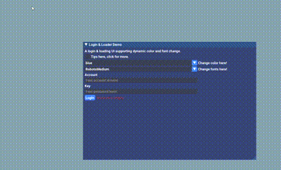

## My Tiny Proj
- Purpose: Make a Login and Loading UI with dynamic color and language switch.
- _All changes in the following file or folder._
```cpp
  /examples/example_win32_opengl3/main.cpp
  /misc/fonts
  /demo
```

## Functions Supported
- Dynamically change colors between _red and blue_.
- Dynamically change fonts between _Roboto-Medium and SourceHanSansSC_.
- Account and Password Input. _No reaction_ if any of the two is not provided.
- Progress bar and Current state text output.

## Env & Build
- Windows 
- Visual Studio 2022
- C++ 14
- Open the folder in VS and Run _/examples/example_win32_opengl3/main.cpp_ can yield the GUI.
- Close previous terminals and GUIs before running a new one, or conflicts may happen. 

## Reference
- <https://pthom.github.io/imgui_manual_online/manual/imgui_manual.html>
- https://github.com/AAA-ALR/ImGui-Tool-Style_Gui/tree/main

## TODO
- Chinese Font is currently included in _/misc/fonts_, but **can not** display chinese as expected. All chinese characters' output is '?'. I have attached "u8" before every chinese character.

## Demo
_demo.gif and demo.mp4 are in demo/ folder._

